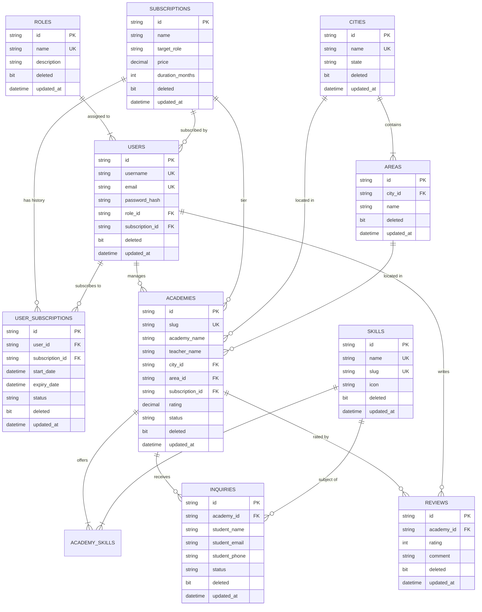

# 🗄️ Database Architecture & SQL Scripts (FindMyMusicGurukul Platform)

This folder contains the complete SQL database table structure, seed data, search queries, views, and schema definitions for the **FindMyMusicGurukul** platform.

---

## 📁 File Structure

```
SQL/
├── 01_schema.sql                  # Core DDL table structure (Roles, Subscriptions, Users, User Subscriptions, Cities, Areas, Skills, Academies, Inquiries, Reviews)
├── 02_seed_data.sql               # Seed data populating master records (Roles, Subscriptions, Cities, Areas, Skills, Sample Academies, Inquiries)
├── 03_procedures_and_queries.sql  # SQL views, search queries, and administrative reporting scripts
├── create_database_and_tables.sql # Master single-execution SQL script for MS SQL Server
└── README.md                      # Database documentation & ER diagrams
```

---

## 🌐 Entity-Relationship (ER) Diagram



---

## 📊 Summary of Tables

*Note: All tables include standard audit soft-delete and timestamp columns (`deleted BIT DEFAULT 0`, `created_at DATETIME`, `updated_at DATETIME`).*

| Table Name | Description | Key Relationships |
| :--- | :--- | :--- |
| `roles` | Master table defining user access roles (`superadmin`, `admin`, `student`). | Parent of `users` |
| `subscriptions` | Master table defining student passes & academy listing packages. | Parent of `users`, `user_subscriptions`, `academies` |
| `users` | Stores student, academy owner, and admin user credentials. | Foreign Keys to `roles` & `subscriptions` |
| `user_subscriptions` | Tracks active & historical subscriptions for students & academies. | Foreign Keys to `users` & `subscriptions` |
| `cities` | Master table for operational cities (e.g., Pune, Mumbai, Delhi, Bangalore). | Parent of `areas` and `academies` |
| `areas` | Master table for localities within cities (e.g., Wakad, Bandra, Indiranagar). | Child of `cities` |
| `skills` | Master table for instruments & vocals taught (e.g., Guitar, Piano, Vocals). | Parent of `academy_skills` |
| `academies` | Stores Music Academy / Guru profile details, status, and ratings. | Foreign Keys to `users`, `subscriptions`, `cities`, `areas` |
| `academy_skills` | Junction table mapping many-to-many relationship between Academies and Skills. | Foreign Keys to `academies`, `skills` |
| `inquiries` | Lead form submissions from interested students. | Foreign Keys to `academies`, `skills` |
| `reviews` | Student ratings and review feedback for academies. | Foreign Keys to `academies`, `users` |

---

## 🚀 How to Execute

### MS SQL Server
Execute [`create_database_and_tables.sql`](file:///c:/Users/deep/Desktop/WPMS_UI/music_guru_backend/SQL/create_database_and_tables.sql) directly inside **SQL Server Management Studio (SSMS)** or Azure Data Studio.

### PostgreSQL
```bash
psql -U postgres -d FindMyMusicGurukul -f SQL/01_schema.sql
psql -U postgres -d FindMyMusicGurukul -f SQL/02_seed_data.sql
psql -U postgres -d FindMyMusicGurukul -f SQL/03_procedures_and_queries.sql
```

### MySQL / MariaDB
```bash
mysql -u root -p FindMyMusicGurukul < SQL/01_schema.sql
mysql -u root -p FindMyMusicGurukul < SQL/02_seed_data.sql
mysql -u root -p FindMyMusicGurukul < SQL/03_procedures_and_queries.sql
```
